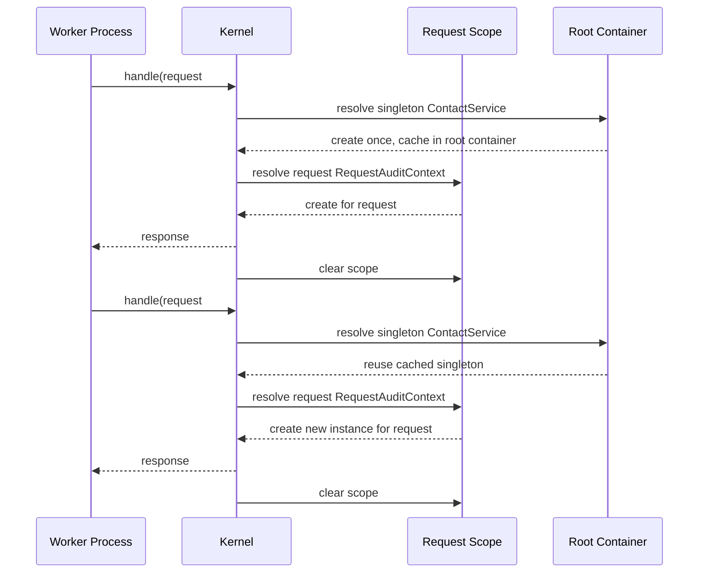

# Celeris Framework User Manual

## 0. What is Celeris?

Celeris is a PHP 8.4 framework for building backend software with explicit architecture, deterministic runtime behavior, and support for both API and MVC styles.

The design goal is to let teams ship high-throughput, maintainable applications without hidden state coupling, especially when running long-lived worker processes.

### Goal

- Provide one consistent backend programming model for `FPM` and worker runtimes (`RoadRunner`, `Swoole`).
- Keep request handling explicit and predictable (`RequestContext`, deterministic reset, explicit DI lifetimes).
- Enable modular application composition through service providers, middleware, and typed contracts.

### Core capabilities

- Runtime model with adapters: `FPMAdapter`, `RoadRunnerAdapter`, `SwooleAdapter`, coordinated by `WorkerRunner`.
- Central `Kernel` lifecycle for bootstrap, routing, middleware, handler dispatch, response finalization, reset, and shutdown.
- DI container with `singleton`, `request`, and `transient` lifetimes plus provider registration/boot hooks.
- HTTP primitives (`Request`, `Response`, cookies, streaming responses) and PSR bridge support at integration boundaries.
- Security subsystem (auth strategies, authorization policies, CSRF protection, rate limiting, security headers).
- Validation + DTO mapping + serialization with typed request mapping.
- Data access stack (DBAL, ORM, migrations) and optional Active Record compatibility layer.
- Cache engine with deterministic invalidation options and HTTP cache finalization support.
- Tooling and distributed-service building blocks (tracing, observability hooks, service auth, message bus abstraction).

### Advantages for developers

- Explicit dependency and request-state flow (no hidden globals for request data).
- Safer worker-mode operation through deterministic request cleanup and lifetime guardrails.
- Same kernel/runtime model for API and MVC projects, reducing context switching.
- Strong modularity via providers and middleware for incremental growth from simple CRUD to larger systems.
- Predictable behavior that is easier to test, reason about, and operate.

### What you can build

- JSON APIs, internal platform services, and microservice-style backends.
- MVC applications returning HTML with PHP templates.
- Hybrid systems where API and HTML endpoints coexist under one kernel composition.
- Service-oriented endpoints with trace propagation, service authentication, and messaging abstractions.

### Limitations (what Celeris is not)

- Not a frontend framework; no built-in SPA tooling, bundler, or client rendering stack.
- Core HTTP contracts are not PSR-7/PSR-15-native (interop is provided through bridges).
- No async reactor/event-loop abstraction in core; request processing is synchronous per request frame.
- No mandatory template engine in core (MVC uses plain PHP view rendering by convention).
- Container resolution is runtime factory-driven; there is no compiled container artifact in the current implementation.
- Some architecture decisions in `docs/ADR` are roadmap-oriented (`Proposed`) and may be ahead of current code.

Note:

PSR-7 (PHP Standard Recommendation) introduces:
 - Heavy stream abstraction.
 - Object cloning for immutability.
 - Interface dispatch overhead.
 - More allocations per request.
 - Larger memory footprint.

It is architecturally clean — but not minimal.
In worker mode especially, stream abstractions can become unnecessary overhead.

By keeping custom core contracts:

Celeris controls:

- Memory layout
- Immutability semantics
- Performance characteristics
- Simplicity of body handling
- Internal API evolution

And it still allows:

- External middleware via bridges

That is a layered approach:

- Core optimized, ecosystem interoperable.

### Where Celeris is strongest

- Backend-heavy systems where correctness and maintainability matter more than framework magic.
- Worker-runtime deployments that need memory reuse without cross-request state leaks.
- Teams that prefer explicit DI, typed contracts, deterministic middleware/routing order, and clear module boundaries.

## Index

0. [0. What is Celeris?](#0-what-is-celeris)
1. [1. Core Concepts](#1-core-concepts)
2. [1.1 Detailed Request Lifecycle](#11-detailed-request-lifecycle)
3. [1.2 Worker Mode: General Introduction](#12-worker-mode-general-introduction)
4. [1.3 How `WorkerRunner` Works](#13-how-workerrunner-works)
5. [1.4 How `FPMAdapter` Works (and how it differs from worker adapters)](#14-how-fpmadapter-works-and-how-it-differs-from-worker-adapters)
6. [1.5 Canonical Worker Mode Lifecycle](#15-canonical-worker-mode-lifecycle)
7. [2. Minimal Bootstraps](#2-minimal-bootstraps)
8. [3. Configuration, Environment, and Bootstrap](#3-configuration-environment-and-bootstrap)
9. [4. DI Container and Service Providers](#4-di-container-and-service-providers)
10. [5. HTTP Abstractions](#5-http-abstractions)
11. [6. Routing, Controllers, and Middleware](#6-routing-controllers-and-middleware)
12. [6.0 Attribute routes vs PHP routes](#60-attribute-routes-vs-php-routes)
13. [7. API Project: End-to-End Example](#7-api-project-end-to-end-example)
14. [8. MVC Project: End-to-End Example](#8-mvc-project-end-to-end-example)
15. [9. Database and ORM](#9-database-and-orm)
16. [10. Optional Active Record Compatibility Layer](#10-optional-active-record-compatibility-layer)
17. [11. Security Subsystem](#11-security-subsystem)
18. [12. Validation and Serialization](#12-validation-and-serialization)
19. [13. Caching and HTTP Cache Semantics](#13-caching-and-http-cache-semantics)
20. [14. Domain Events](#14-domain-events)
21. [15. Tooling Platform (CLI + Web)](#15-tooling-platform-cli--web)
22. [16. Distributed Features (Microservice/SOA)](#16-distributed-features-microservicesoa)
23. [17. Transactions, CRUD, and Connection Patterns (Decision Guide)](#17-transactions-crud-and-connection-patterns-decision-guide)
24. [18. API vs MVC Cheat Sheet](#18-api-vs-mvc-cheat-sheet)
25. [19. Operational Checklist](#19-operational-checklist)
26. [20. Reference Map](#20-reference-map)
27. [21. Questions and Answers](#21-questions-and-answers)
28. [22. Third-Party Package Author Guide](#22-third-party-package-author-guide)

This manual documents the current framework implementation in `packages/framework/src`.

It is written as a practical guide with two complete project styles:
- API-first project
- MVC-style project (controllers + PHP views)

It also covers all core subsystems: runtime, kernel lifecycle, DI, routing, middleware, HTTP abstractions, configuration, security, validation/serialization, database/ORM, optional Active Record compatibility, caching, tooling, and distributed services.

## 1. Core Concepts

Celeris is built around these rules:
- One process can handle many requests (worker-safe)
- Bootstrap once, reset deterministically between requests
- No hidden globals for request state (`RequestContext` is explicit)
- Request objects are immutable; response objects are immutable with builder support
- DI and service providers are explicit
- Routing and middleware order are deterministic

Key runtime flow:
1. `WorkerRunner` obtains `RuntimeRequest` from an adapter (`FPMAdapter`, `RoadRunnerAdapter`, `SwooleAdapter`)
2. `Kernel::handle(RequestContext, Request)` executes security pre-checks, routing, middleware, handler invocation, and response finalizers
3. `Kernel::reset()` clears request-scoped state and applies hot-reload snapshot logic when enabled
4. Worker adapter resets runtime-level state

### 1.1 Detailed Request Lifecycle

This is the full request lifecycle as implemented by `WorkerRunner + Kernel`.

```text
+---------------------------+
| Runtime Adapter           |
| (FPM/RoadRunner/Swoole)   |
+------------+--------------+
             |
             v
+---------------------------+
| WorkerRunner::run()       |
| - kernel.boot() once      |
| - adapter.start() once    |
+------------+--------------+
             |
             v (loop)
+---------------------------+
| adapter.nextRequest()     |
| -> RuntimeRequest         |
+------------+--------------+
             |
             v
+---------------------------+
| Kernel::handle(ctx, req)  |
+------------+--------------+
             |
             v
+---------------------------+
| Request scope setup       |
| - create request container|
| - ctx + container         |
| - contextContainer.enter  |
+------------+--------------+
             |
             v
+---------------------------+
| Security pre-routing      |
| - normalize input         |
| - request validator       |
| - SQL injection guard     |
| - rate limiter            |
| - authenticate            |
| - CSRF (contextual)       |
+------------+--------------+
             |
             v
+---------------------------+
| Router resolve            |
| - method/path/version     |
+------+--------------------+
       | hit
       |                     miss
       |                     |
       v                     v
+---------------------+   +----------------------+
| Route metadata set  |   | 405 or 404 response  |
| authorize handler   |   +----------+-----------+
+----------+----------+              |
           |                         |
           v                         v
+---------------------------+   +---------------------------+
| Middleware dispatcher     |   | Response pipeline         |
| (global + route ordered)  |   | finalizers                |
+------------+--------------+   +------------+--------------+
             |                               |
             v                               v
+---------------------------+      +------------------------+
| Handler invocation        |      | return response        |
| - args resolved from:     |      +------------------------+
|   RequestContext/Request  |
|   container services      |
|   DTO mapper              |
|   path params             |
+------------+--------------+
             |
             v
+---------------------------+
| Raw handler result        |
| -> Response/JSON/text     |
+------------+--------------+
             |
             v
+---------------------------+
| Response pipeline         |
| - security headers        |
| - HTTP cache headers      |
+------------+--------------+
             |
             v
+---------------------------+
| WorkerRunner sends output |
| adapter.send(...)         |
+------------+--------------+
             |
             v
+---------------------------+
| Deterministic cleanup     |
| - kernel.reset()          |
| - adapter.reset()         |
+------------+--------------+
             |
             v
        next request
```

Execution details by stage:
1. Process start.
- `WorkerRunner` calls `kernel.boot()` once, then `adapter.start()`.
- Bootstrap pipeline executes and container is built.

2. Request frame acquisition.
- Adapter returns a `RuntimeRequest` containing `RequestContext + Request`.
- In FPM mode this is one request per process lifecycle.
- In worker mode this repeats in a loop for many requests.

3. Request scope initialization.
- Kernel creates a request-scoped container from root container.
- Scope is attached to `RequestContext` attribute `container`.
- Context is entered into `RequestContextContainer` (fiber-safe stack).

4. Pre-routing security gate.
- `SecurityKernelGuard::beforeRouting()` runs:
- Input normalization.
- Request shape/size/header validation.
- SQLi pattern guard for query/body scalar inputs.
- Rate limit enforcement.
- Authentication strategy resolution.
- CSRF protection only when context indicates session-style semantics.

5. Route resolution and authorization.
- Router resolves by HTTP method + path + API version (`x-api-version` or `api_version` query).
- If no route but path matches other methods, kernel returns `405` with `Allow`.
- If no route match at all, kernel returns `404`.
- On match, route metadata and path params are attached to context.
- Policy engine evaluates `#[Authorize]` rules for class/method handler.

6. Middleware pipeline execution.
- Kernel pipeline middleware executes first.
- Middleware dispatcher executes registered global middleware, then route middleware, in deterministic order.
- Middleware can short-circuit by returning a response early.

7. Handler invocation and argument binding.
- Handler is resolved from callable, `[Class, method]`, or `Class@method`.
- Class handlers are resolved from request container when available.
- Parameters are bound from:
- `RequestContext`, `Request`.
- Container services by type.
- DTO mapping for classes annotated with `#[Dto]`.
- Path parameters by name and type casting (`int`, `float`, `bool`, `string`).

8. Response materialization.
- If handler returns `Response`, it is used directly.
- If handler returns `array/object`, kernel serializes to JSON response.
- Otherwise kernel casts to text response body.

9. Response finalization.
- `ResponsePipeline` finalizers run in order.
- Security headers finalizer applies security defaults.
- HTTP cache finalizer can add `Cache-Control`, `Vary`, `ETag`, `Last-Modified`.

10. Error paths.
- `ValidationException` becomes structured JSON error response.
- `SecurityException` becomes response with status + auth/security headers.
- Unhandled exceptions in `WorkerRunner` are converted to `500 Internal Server Error`.

11. Cleanup and reset.
- Kernel always leaves/clears current request context stack.
- Request-scoped container is cleared.
- `kernel.reset()` runs request cleanup hooks and context cleanup.
- If hot reload is enabled and config fingerprint changed, container/services are rebuilt safely.
- Adapter reset runs to clear runtime-specific request artifacts.

12. Process shutdown.
- When adapter has no more requests, runner calls `adapter.stop()` and `kernel.shutdown()`.
- Registered shutdown hooks execute deterministically.

### 1.2 Worker Mode: General Introduction

Worker Mode means one long-lived PHP process handles many HTTP requests in sequence.

Core characteristics:
- Bootstrap is executed once per process startup.
- Services can stay in memory between requests.
- Each request still needs explicit isolation and cleanup.
- Request-scoped state must be reset deterministically after every request.

Why Worker Mode exists:
- Avoid repeated framework bootstrap cost on every request.
- Improve throughput/latency for hot paths.
- Enable long-lived infrastructure in memory (connection pools, caches, routing trees).

What you must handle carefully:
- Never keep request/user-specific mutable state in singleton services.
- Always rely on request scope (`RequestContext`, request-scoped container services).
- Ensure reset hooks clear transient runtime artifacts between requests.

In this framework, Worker Mode safety is enforced by:
- `RequestContextContainer` with explicit enter/leave semantics (fiber-safe isolation).
- request-scoped container creation in `Kernel::handle()`.
- deterministic cleanup in `Kernel::reset()` and adapter `reset()`.

### 1.3 How `WorkerRunner` Works

`WorkerRunner` is the process-level orchestration loop. It sits between the runtime adapter and the kernel.

Execution contract:
1. Start phase (once).
- `kernel.boot()` executes bootstrap/config/container initialization.
- `adapter.start()` initializes runtime transport.

2. Request loop.
- `adapter.nextRequest()` returns `RuntimeRequest` frames until it returns `null`.
- For each frame, `WorkerRunner` calls `kernel.handle(ctx, req)`.
- `SecurityException` is converted into a response with its status/headers.
- Any other unhandled exception is converted to `500 Internal Server Error`.

3. Emit and cleanup per request.
- `adapter.send(runtimeRequest, response)` writes response back to runtime transport.
- In a `finally` block, `WorkerRunner` always executes:
- `kernel.reset()`
- `adapter.reset()`
- This guarantees deterministic cleanup even when handler execution fails.

4. Stop phase (once).
- When no more request frames are available, `adapter.stop()` is called.
- `kernel.shutdown()` is called and shutdown hooks run.

Practical consequence:
- `WorkerRunner` is the boundary that guarantees one bootstrap/many requests while preserving per-request isolation.

### 1.4 How `FPMAdapter` Works (and how it differs from worker adapters)

`FPMAdapter` is the bridge for traditional PHP-FPM execution.

What PHP-FPM is (conceptually):
- `FPM` stands for `FastCGI Process Manager` for PHP.
- A web server (typically Nginx, sometimes Apache via proxy) receives HTTP requests and forwards dynamic PHP requests to PHP-FPM using the FastCGI protocol.
- PHP-FPM maintains a pool of PHP worker processes (`pm = static|dynamic|ondemand`) and distributes incoming requests among them.

How FPM request processing works:
1. Web server accepts HTTP request.
2. Web server routes PHP target (for example `public/index.php`) to PHP-FPM.
3. One FPM worker process executes the script for that request.
4. Script returns output/status/headers through FastCGI back to web server.
5. Worker becomes available for another request.

Important implications:
- FPM worker processes are long-lived, but PHP userland execution context is request-bounded.
- Your application code is loaded/executed per request invocation of the front controller.
- Request-specific runtime state does not carry over automatically between requests in normal FPM flow.
- Shared process-level resources can still exist (for example OPcache bytecode cache), but request data itself must be treated as ephemeral.

How this differs from explicit worker runtimes:
- In RoadRunner/Swoole worker mode, one application bootstrap can intentionally serve many requests in a single userland runtime loop.
- In FPM mode, the web server/FPM lifecycle already provides request boundaries, so the framework adapter exposes one request frame and exits.

Behavior in this framework:
- `start()` is a no-op.
- `nextRequest()` serves exactly one request using:
- `RequestContext::fromGlobals($_SERVER)`
- `Request::fromGlobals(...)`
- It then returns `null` on the next call (single runtime frame).
- `send()` emits status, headers, cookies, and body using PHP output functions.
- `reset()` and `stop()` are no-ops.

Why this design:
- In FPM, each script invocation is already request-bounded by the web server/FPM model.
- So the adapter exposes one request frame to `WorkerRunner`, then exits cleanly.

Contrast with worker adapters:
- `RoadRunnerAdapter` and `SwooleAdapter` are loop-driven and can yield many request frames in one process.
- Their `reset()` stage is operationally important because process memory is reused across many requests.

### 1.5 Canonical Worker Mode Lifecycle

This section describes the canonical lifecycle of a worker-mode process, independent of a specific transport implementation.

Canonical lifecycle phases:
1. Process startup.
- Worker process starts.
- Runtime adapter initializes transport/runtime bindings.

2. Bootstrap once.
- Kernel bootstrap runs once for the process.
- Core services/container/routing/security/config are initialized.

3. Request loop.
- Worker waits for request frame.
- If frame exists, request is handled.
- If no frame (shutdown signal/transport closed), loop exits.

4. Per-request execution.
- Request context/scope setup.
- Security gate, routing, middleware, handler, finalizers.
- Response emitted to transport.

5. Deterministic reset.
- Request-scoped memory and runtime artifacts are cleared.
- Optional hot-reload checks can rebuild container safely.

6. Graceful shutdown.
- Adapter stop and kernel shutdown hooks run.
- Process exits.

Graph 1: Canonical worker state flow

```text
+-------------------+
| Process Started   |
+---------+---------+
          |
          v
+-------------------+
| Adapter Start     |
| Kernel Boot Once  |
+---------+---------+
          |
          v
+---------------------------+
| Wait For Next Request     |
| adapter.nextRequest()     |
+----+------------------+---+
     |                  |
     | request frame    | null / stop signal
     v                  v
+-------------------+  +--------------------+
| Handle Request    |  | Exit Loop          |
| kernel.handle()   |  +---------+----------+
+---------+---------+            |
          |                      v
          v            +--------------------+
+-------------------+  | Adapter Stop       |
| Send Response     |  | Kernel Shutdown    |
| adapter.send()    |  +---------+----------+
+---------+---------+            |
          |                      v
          v            +--------------------+
+-------------------+  | Process Ended      |
| Reset Per Request |  +--------------------+
| kernel.reset()    |
| adapter.reset()   |
+---------+---------+
          |
          +-------> back to "Wait For Next Request"
```

Graph 2: Canonical per-request sequence in worker mode

```text
Runtime Adapter      WorkerRunner          Kernel              App Code
     |                   |                   |                    |
     | nextRequest()     |                   |                    |
     |------------------>|                   |                    |
     |   RuntimeRequest  |                   |                    |
     |<------------------|                   |                    |
     |                   | handle(ctx, req)  |                    |
     |                   |------------------>|                    |
     |                   |                   | pipeline + handler |
     |                   |                   |------------------->|
     |                   |                   |<-------------------|
     |                   |    Response       |                    |
     |                   |<------------------|                    |
     | send(response)    |                   |                    |
     |<------------------|                   |                    |
     |                   | reset()           |                    |
     |                   |------------------>|                    |
     |                   | adapter.reset()   |                    |
     |                   |-------------------+------------------> |
```

Why this canonical model matters:
- It makes bootstrap cost predictable (`once per process`).
- It preserves correctness via strict per-request reset.
- It allows high throughput while avoiding cross-request state leaks.

Common mistakes to avoid in worker mode:
- Storing request/user mutable state in singleton services.
- Assuming static properties are request-isolated.
- Forgetting cleanup in custom middleware/adapters.
- Performing non-idempotent side effects before request validation/authorization gates.

## 2. Minimal Bootstraps

### 2.1 Minimal API/MVC front controller

`public/index.php`:

```php
<?php

declare(strict_types=1);

require __DIR__ . '/../vendor/autoload.php';

use Celeris\Framework\Kernel\Kernel;
use Celeris\Framework\Runtime\FPMAdapter;
use Celeris\Framework\Runtime\WorkerRunner;

$kernel = new Kernel();
$runner = new WorkerRunner($kernel, new FPMAdapter());
$runner->run();
```

### 2.2 Worker runtimes (RoadRunner/Swoole)

`RoadRunnerAdapter` and `SwooleAdapter` use callback-based transport integration. You provide receiver/responder callbacks and run through `WorkerRunner`.

```php
$adapter = new RoadRunnerAdapter(
    receiver: fn (): ?array => $nextFrameFromRuntime(),
    responder: fn ($runtimeRequest, $response): void => $sendBackToRuntime($runtimeRequest, $response),
);

$runner = new WorkerRunner($kernel, $adapter);
$runner->run();
```

## 3. Configuration, Environment, and Bootstrap

By default, `Kernel` loads configuration from:
- `config/*.php`
- `.env`
- `secrets/` directory

through `ConfigLoader + EnvironmentLoader`, then builds immutable runtime config snapshots (`ConfigSnapshot`).

### 3.1 Example config files

`config/app.php`:

```php
<?php

return [
    'name' => 'Contacts API',
    'version' => '1.0.0',
];
```

`config/database.php`:

```php
<?php

return [
    'default' => 'main',
    'connections' => [
        'main' => [
            'driver' => 'pgsql',
            'host' => getenv('DB_HOST') ?: '127.0.0.1',
            'port' => 5432,
            'database' => getenv('DB_NAME') ?: 'contacts_app',
            'username' => getenv('DB_USER') ?: 'app',
            'password' => getenv('DB_PASS') ?: '',
            'charset' => 'utf8',
        ],
        'analytics' => [
            'driver' => 'sqlite',
            'path' => '/tmp/contacts-analytics.sqlite',
        ],
    ],
];
```

`config/security.php`:

```php
<?php

return [
    'auth' => [
        'jwt' => ['enabled' => true],
        'opaque' => ['enabled' => true],
        'api_token' => ['enabled' => true],
        'cookie_session' => ['enabled' => true, 'cookie' => 'session_id'],
        'mtls' => ['enabled' => false],
    ],

    // jwt secret can come from secret file or env
    'jwt' => [
        'secret' => getenv('JWT_SECRET') ?: '',
        'algorithms' => ['HS256'],
        'leeway_seconds' => 30,
        'issuer' => 'contacts-app',
        'audience' => 'contacts-clients',
    ],

    // token registries for in-memory strategies
    'tokens' => [
        'opaque' => [
            'opaque-admin-token' => [
                'subject' => 'admin-1',
                'roles' => ['admin'],
                'permissions' => ['contacts:read', 'contacts:write'],
                'token_id' => 'opaque-admin-id',
            ],
        ],
        'api' => [
            'api-key-123' => [
                'subject' => 'integration-service',
                'roles' => ['service'],
                'permissions' => ['contacts:read'],
            ],
        ],
    ],

    'sessions' => [
        'session-abc' => [
            'subject' => 'web-user-1',
            'roles' => ['user'],
            'permissions' => ['contacts:read'],
        ],
    ],

    'csrf' => [
        'enabled' => true,
        'methods' => ['POST', 'PUT', 'PATCH', 'DELETE'],
        'cookie' => 'csrf_token',
        'header' => 'x-csrf-token',
        'field' => '_csrf',
        'session_cookie' => 'session_id',
    ],

    'request' => [
        'max_body_bytes' => 1048576,
        'max_header_value_length' => 8192,
    ],

    'rate_limit' => [
        'limit' => 120,
        'window_seconds' => 60,
        'burst' => 0,
    ],

    'password' => [
        'algorithm' => 'argon2id',
        'options' => ['memory_cost' => 65536, 'time_cost' => 4, 'threads' => 2],
    ],

    'headers' => [
        'x-frame-options' => 'DENY',
        'x-content-type-options' => 'nosniff',
    ],
];
```

### 3.2 Custom config loader + validator

```php
use Celeris\Framework\Config\ConfigLoader;
use Celeris\Framework\Config\ConfigValidator;
use Celeris\Framework\Config\EnvironmentLoader;

$validator = (new ConfigValidator())
    ->requireConfig('database.connections.main.driver')
    ->requireSecret('JWT_SECRET');

$loader = new ConfigLoader(
    __DIR__ . '/../config',
    new EnvironmentLoader(
        __DIR__ . '/../.env',
        __DIR__ . '/../secrets',
        false,
        true, // inject loaded values into $_ENV/$_SERVER for getenv-style config files
    ),
    $validator,
);

$kernel->setConfigLoader($loader);
```

### 3.3 Hot reload and hot restart

- Hot reload checks config snapshot fingerprint during `Kernel::reset()`.
- `Kernel::enableHotReload(false)` disables this behavior.
- `Kernel::hotRestart()` triggers shutdown + bootstrap re-run.

## 4. DI Container and Service Providers

The framework container supports lifetimes:
- `singleton`
- `request`
- `transient`

Provider lifecycle (high-level):

```mermaid
flowchart TD
    A[public/index.php] --> B[new Kernel(...)]
    B --> C[$kernel->registerProvider(new AppServiceProvider())]
    C --> D[WorkerRunner::run()]
    D --> E[Kernel::boot()]
    E --> F[Kernel::rebuildContainer(snapshot)]
    F --> G[Copy core ServiceRegistry]
    G --> H[ProviderRegistry::registerProviders()]
    H --> I[Build Container and validate dependencies]
    I --> J[ProviderRegistry::bootProviders()<br/>only BootableServiceProviderInterface]
    J --> K[Kernel handles requests]
```

Notes:
- Provider registration is explicit in bootstrap (`registerProvider(...)`).
- There is no provider auto-discovery list in this flow.

### 4.1 Lifetime semantics

Use lifetime intentionally, especially in worker mode where one process handles many requests.

`singleton`
- Created once per root container build and reused for all resolutions.
- Best for stateless shared infrastructure and expensive objects.
- Typical examples:
  - config repositories
  - serializers/validators
  - routers and shared registries
  - service classes that do not store request-specific mutable state
- Important in workers:
  - singleton instances can outlive many requests.
  - do not store per-request user/session/request payload state in singleton properties.

`request`
- Created once per request scope and reused only inside that request.
- `Kernel::handle()` creates a request-scoped container and clears it at request end.
- Best for request-bound state/services, for example:
  - correlation/request context wrappers
  - per-request unit of work objects
  - auth/session facades that cache request-local computation

`transient`
- New instance every time `get()` is called.
- Best for lightweight objects or short-lived builders that should not be shared.
- Typical examples:
  - response builders
  - command objects
  - pure helper objects where instance reuse has no value

Container guardrails:
- Circular dependencies are validated when container is rebuilt.
- A `singleton` cannot depend on a `request` service (explicitly blocked by container rules).
- Prefer constructor injection and keep lifetimes explicit in provider registration.

Quick decision guide:
- Choose `singleton` when the object is stateless (or safely shared) and reused broadly.
- Choose `request` when the object must be isolated per HTTP request.
- Choose `transient` when each resolution should be a fresh instance.

### 4.2 Registration examples by lifetime

```php
<?php

declare(strict_types=1);

namespace App;

use Celeris\Framework\Container\ContainerInterface;
use Celeris\Framework\Container\ServiceProviderInterface;
use Celeris\Framework\Container\ServiceRegistry;

final class LifetimeExamplesProvider implements ServiceProviderInterface
{
    public function register(ServiceRegistry $services): void
    {
        // singleton: one instance shared across requests (until container rebuild)
        $services->singleton(
            \App\Shared\Clock::class,
            static fn (ContainerInterface $c): \App\Shared\Clock => new \App\Shared\Clock(),
        );

        // request: one instance per request
        $services->request(
            \App\Http\RequestAuditContext::class,
            static fn (ContainerInterface $c): \App\Http\RequestAuditContext
                => new \App\Http\RequestAuditContext(),
        );

        // transient: a new instance on every resolution
        $services->transient(
            \App\Http\ApiProblemBuilder::class,
            static fn (ContainerInterface $c): \App\Http\ApiProblemBuilder
                => new \App\Http\ApiProblemBuilder(),
        );
    }
}
```

Example of an invalid lifetime dependency (do not do this):

```php
$services->singleton(
    App\Bad\SingletonNeedingRequestState::class,
    static fn (ContainerInterface $c): App\Bad\SingletonNeedingRequestState
        => new App\Bad\SingletonNeedingRequestState(
            $c->get(App\Http\RequestAuditContext::class) // request-scoped
        ),
    [App\Http\RequestAuditContext::class],
);
```

This fails by design because a singleton cannot be built from a request-scoped dependency.

### 4.3 Provider example

`app/AppServiceProvider.php`:

```php
<?php

declare(strict_types=1);

namespace App;

use App\Contacts\ContactRepository;
use App\Contacts\ContactService;
use Celeris\Framework\Container\ServiceProviderInterface;
use Celeris\Framework\Container\ServiceRegistry;
use Celeris\Framework\Container\ContainerInterface;
use Celeris\Framework\Database\DBAL;
use Celeris\Framework\Database\ORM\EntityManager;

final class AppServiceProvider implements ServiceProviderInterface
{
    public function register(ServiceRegistry $services): void
    {
        $services->singleton(
            ContactRepository::class,
            static fn (ContainerInterface $c): ContactRepository
                => new ContactRepository($c->get(EntityManager::class), $c->get(DBAL::class)),
            [EntityManager::class, DBAL::class],
        );

        $services->singleton(
            ContactService::class,
            static fn (ContainerInterface $c): ContactService
                => new ContactService($c->get(ContactRepository::class)),
            [ContactRepository::class],
        );
    }
}
```

This is a repository-based provider example.
If you prefer service-first persistence, register `ContactService` directly with `EntityManager`/`DBAL` dependencies and skip `ContactRepository`.

Register provider in bootstrap:

```php
$kernel->registerProvider(new \App\AppServiceProvider());
```

### 4.4 Request scope notes

`Kernel::handle()` creates a request-scoped container and stores it in `RequestContext`.
Services registered with request lifetime are isolated per request and cleared at the end of that request.



## 5. HTTP Abstractions

### 5.1 Request

`Request` is immutable, with helpers:
- `getMethod()`, `getPath()`
- `getHeader()`, `headers()`
- `getQueryParam()`, `getParsedBody()`
- `getUploadedFile()`
- `withXxx()` methods that return copies

### 5.2 Response and builder

`Response` is immutable. `ResponseBuilder` is mutable and ergonomic.

```php
use Celeris\Framework\Http\ResponseBuilder;
use Celeris\Framework\Http\HttpStatus;

$response = (new ResponseBuilder())
    ->status(HttpStatus::CREATED)
    ->json(['id' => 10, 'ok' => true])
    ->build();
```

### 5.3 Cookies

```php
use Celeris\Framework\Http\SetCookie;

$response = $response->withCookie(
    (new SetCookie('session_id', 'abc123'))
        ->withHttpOnly(true)
        ->withSecure(true)
        ->withSameSite('Lax')
);
```

### 5.4 Streaming responses

```php
use Celeris\Framework\Http\ResponseBuilder;

$response = (new ResponseBuilder())
    ->header('content-type', 'text/plain; charset=utf-8')
    ->stream(function (callable $write): void {
        $write("chunk-1\n");
        $write("chunk-2\n");
    })
    ->build();
```

### 5.5 Content negotiation

```php
use Celeris\Framework\Http\ContentNegotiator;

$type = ContentNegotiator::negotiate(
    ['application/json', 'text/html'],
    $request->getHeader('accept'),
    'application/json'
);
```

### 5.6 PSR bridges (optional)

PSR bridges let Celeris stay framework-native at the core (`Request`/`Response`) while still interoperating with PSR-based ecosystems at integration boundaries.

In the current implementation:
- `PsrRequestBridge::fromPsrRequest($psrRequest)` converts an incoming PSR request object into `Celeris\Framework\Http\Request`.
- `PsrResponseBridge::toPsrResponse($response, $responseFactory, $streamFactory)` converts `Celeris\Framework\Http\Response` into a PSR response object.

This means package/application internals can use Celeris contracts for deterministic behavior, and only adapt at the edge where a PSR stack is involved.

Example boundary adapter used by a third-party package:

```php
<?php

declare(strict_types=1);

namespace Vendor\Package\Interop;

use Celeris\Framework\Http\Psr\PsrRequestBridge;
use Celeris\Framework\Http\Psr\PsrResponseBridge;
use Vendor\Package\Http\PackageHttpHandler;

final class PsrBoundaryAdapter
{
    public function __construct(
        private readonly PackageHttpHandler $handler,
        private readonly object $responseFactory, // PSR-17 ResponseFactoryInterface
        private readonly object $streamFactory,   // PSR-17 StreamFactoryInterface
    ) {
    }

    public function handle(object $psrRequest): object
    {
        $request = PsrRequestBridge::fromPsrRequest($psrRequest);
        $response = $this->handler->handle($request);

        return PsrResponseBridge::toPsrResponse(
            $response,
            fn (int $status): object => $this->responseFactory->createResponse($status),
            fn (string $body): object => $this->streamFactory->createStream($body),
        );
    }
}
```

Notes:
- Keep conversion at boundaries only; avoid converting back and forth inside business logic.
- If your package depends on PSR interfaces, make them optional Composer dependencies when possible.
- Current bridges are directional (PSR request -> Celeris request, Celeris response -> PSR response).

## 6. Routing, Controllers, and Middleware

### 6.0 Attribute routes vs PHP routes

Celeris does not have a config toggle for “attribute vs PHP routes”. The routing style is chosen by how you wire routes in bootstrap:

- Attribute routes: call `registerController(...)` to scan `#[Route]` / `#[RouteGroup]` attributes.
- PHP routes: call `routes()->get/post/...` (or `groupRoutes(...)`) to register route definitions directly.

You can use either approach or mix both in the same app.

#### Attribute route example

```php
$kernel->registerController(ContactController::class);
// or
$kernel->registerController(ContactController::class, new RouteGroup(prefix: '/api'));
```

#### PHP route example

```php
$kernel->routes()->get('/health', function (RequestContext $ctx, Request $request): Response {
    return new Response(200, ['content-type' => 'application/json'], '{"ok":true}');
});

$kernel->routes()->post('/contacts', [ContactController::class, 'create']);

$kernel->groupRoutes(new RouteGroup(prefix: '/api', middleware: ['api.auth']), function (RouteCollector $routes) {
    $routes->get('/contacts', [ContactController::class, 'index']);
    $routes->post('/contacts', [ContactController::class, 'create']);
});
```

### 6.1 Programmatic routing

```php
use Celeris\Framework\Routing\RouteGroup;
use Celeris\Framework\Routing\RouteMetadata;

$kernel->groupRoutes(
    new RouteGroup(prefix: '/api', middleware: ['api.auth'], version: 'v1', tags: ['API']),
    function ($routes): void {
        $routes->get('/contacts', [\App\Contacts\ContactController::class, 'index']);

        $routes->get(
            '/contacts/{id}',
            [\App\Contacts\ContactController::class, 'show'],
            metadata: new RouteMetadata(
                name: 'contacts.show',
                summary: 'Get one contact',
                tags: ['Contacts'],
            )
        );
    }
);
```

### 6.2 Attribute routing

```php
<?php

declare(strict_types=1);

namespace App\Contacts\Http;

use Celeris\Framework\Http\Request;
use Celeris\Framework\Http\RequestContext;
use Celeris\Framework\Http\Response;
use Celeris\Framework\Routing\Attribute\Route;
use Celeris\Framework\Routing\Attribute\RouteGroup;

#[RouteGroup(prefix: '/contacts', middleware: ['api.auth'], version: 'v1', tags: ['Contacts'])]
final class ContactController
{
    #[Route(methods: ['GET'], path: '/', summary: 'List contacts')]
    public function index(RequestContext $ctx, Request $request): Response
    {
        return new Response(200, ['content-type' => 'application/json; charset=utf-8'], '[]');
    }

    #[Route(methods: ['GET'], path: '/{id}', summary: 'Get contact')]
    public function show(RequestContext $ctx, Request $request, int $id): Response
    {
        return new Response(200, ['content-type' => 'application/json; charset=utf-8'], (string) json_encode(['id' => $id]));
    }
}
```

Register it:

```php
$kernel->registerController(\App\Contacts\Http\ContactController::class, new \Celeris\Framework\Routing\RouteGroup(prefix: '/api'));
```

### 6.3 Handler argument resolution

The kernel resolves handler parameters in this order:
- `RequestContext` type => current context
- `Request` type => current request
- container class type => resolved service
- DTO class marked with `#[Dto]` => mapped from payload/query
- path params by name (`{id}` -> `$id`), with scalar casting
- `array $params` or parameter named `params` => full path-param map

### 6.4 Middleware

Register middleware:

```php
$kernel->registerMiddleware('api.auth', new \App\Http\Middleware\RequireAuthMiddleware());
$kernel->addGlobalMiddleware('api.auth'); // optional global execution
```

`RequireAuthMiddleware` example:

```php
<?php

declare(strict_types=1);

namespace App\Http\Middleware;

use Celeris\Framework\Http\Request;
use Celeris\Framework\Http\RequestContext;
use Celeris\Framework\Http\Response;
use Celeris\Framework\Middleware\MiddlewareInterface;

final class RequireAuthMiddleware implements MiddlewareInterface
{
    public function handle(RequestContext $ctx, Request $request, callable $next): Response
    {
        if ($ctx->getAuth() === null) {
            return new Response(401, ['content-type' => 'application/json; charset=utf-8'], '{"error":"unauthorized"}');
        }

        return $next($ctx, $request);
    }
}
```

### 6.5 Middleware introspection

```php
$all = $kernel->inspectMiddleware();
$routeOnly = $kernel->inspectMiddleware('GET', '/api/contacts/10', 'v1');
```

### 6.6 OpenAPI generation and validation

```php
$openApi = $kernel->generateOpenApi('Contacts API', '1.0.0');
$errors = $kernel->validateOpenApi($openApi);

if ($errors !== []) {
    throw new RuntimeException('OpenAPI invalid: ' . implode('; ', $errors));
}
```

## 7. API Project: End-to-End Example

This section is a complete API-style setup with CRUD, service classes, validation, auth, transactions, and Data Mapper ORM.
The framework supports two persistence styles:
- Service-first: keep persistence operations directly in the service class (common for simple CRUD).
- Service + repository: extract persistence to a repository when query complexity or reuse grows.

Install an API project:

```bash
composer create-project celeris/api users-service
```

This command installs `celeris/framework` into `vendor/celeris/framework`.
Set your runtime values in `.env` (or start from `.env.example`).

Default `.env` keys in the API scaffold:
- `APP_NAME`, `APP_ENV`, `APP_DEBUG`, `APP_URL`, `APP_TIMEZONE`, `APP_VERSION`
- `DB_DEFAULT`, `DB_SQLITE_PATH`
- `MYSQL_*`, `MARIADB_*`, `PGSQL_*`, `SQLSRV_*`
- `SECURITY_AUTH_*`, `SECURITY_CSRF_ENABLED`, `SECURITY_RATE_LIMIT_*`, `JWT_SECRET`, `JWT_LEEWAY_SECONDS`

### 7.1 Suggested structure

```text
api-app/
  .env
  .env.example
  public/
    index.php
  config/
    app.php
    database.php
    security.php
  scripts/
    view-smoke.php
  app/
    AppServiceProvider.php
    Models/
      Contact.php
    Services/
      ContactService.php
    Repositories/ (optional)
      ContactRepository.php
    Http/
      Controllers/
        Api/
          ContactController.php
      Middleware/
        RequireAuthMiddleware.php
      DTOs/
        CreateContactDto.php
        UpdateContactDto.php
    Events/
      ContactCreatedEvent.php
```

Yes, this structure includes model classes.
In this API layout, model/entity classes live in `app/Models/` (for example `Contact.php`).

What each folder/file is for:
- `public/index.php`
- Front controller entrypoint. Boots kernel + runtime adapter and handles requests.
- `config/app.php`
- Application metadata and app-level settings.
- `config/database.php`
- Connection definitions (`default`, named `connections`, driver settings).
- `config/security.php`
- Security/auth/rate-limit/CSRF/password/hash settings.
- `app/AppServiceProvider.php`
- Composition root for your app services. Registers service/controller dependencies, and repositories only if you use that pattern.
- `app/Models/Contact.php`
- Domain entity model (Data Mapper style). Maps PHP object properties to table columns via ORM attributes.
- `app/Http/DTOs/CreateContactDto.php`
- Input contract for create operations. Used for request mapping + validation.
- `app/Http/DTOs/UpdateContactDto.php`
- Input contract for update operations.
- `app/Http/Controllers/Api/ContactController.php`
- HTTP transport layer for Contacts endpoints (routing, request/response orchestration).
- `app/Repositories/ContactRepository.php` (optional)
- Persistence access layer (EntityManager/DBAL queries) when you choose the repository pattern.
- `app/Services/ContactService.php`
- Business use-case layer. Coordinates validation-ready DTOs, persistence operations (directly or via repository), and transaction boundaries.
- `app/Http/Middleware/RequireAuthMiddleware.php`
- Shared HTTP middleware layer for auth guards and request preprocessing.

Recommended optional additions as the API grows:
- `app/Domain/Event/`
- Domain events emitted by your business layer.
- `app/Http/Requests/`
- HTTP request mapping classes for complex endpoints.
- `app/Database/Migration/`
- Database migrations used by `MigrationRunner`.

### 7.2 Domain model (Data Mapper style)

`app/Contacts/Domain/Contact.php`:

```php
<?php

declare(strict_types=1);

namespace App\Contacts\Domain;

use Celeris\Framework\Database\ORM\Attribute\Column;
use Celeris\Framework\Database\ORM\Attribute\Entity;
use Celeris\Framework\Database\ORM\Attribute\Id;

#[Entity(table: 'contacts')]
final class Contact
{
    #[Id(generated: false)]
    #[Column('id')]
    public int $id;

    #[Column('first_name')]
    public string $firstName;

    #[Column('last_name')]
    public string $lastName;

    #[Column('phone')]
    public string $phone;

    #[Column('address')]
    public string $address;

    #[Column('age')]
    public int $age;
}
```

### 7.3 DTOs + validation

`app/Contacts/Dto/CreateContactDto.php`:

```php
<?php

declare(strict_types=1);

namespace App\Contacts\Dto;

use Celeris\Framework\Serialization\Attribute\Dto;
use Celeris\Framework\Serialization\Attribute\MapFrom;
use Celeris\Framework\Validation\Attribute\Length;
use Celeris\Framework\Validation\Attribute\Range;
use Celeris\Framework\Validation\Attribute\Required;
use Celeris\Framework\Validation\Attribute\StringType;

#[Dto]
final class CreateContactDto
{
    public function __construct(
        #[Required]
        public int $id,

        #[Required, StringType, Length(min: 1, max: 100)]
        #[MapFrom('first_name')]
        public string $firstName,

        #[Required, StringType, Length(min: 1, max: 100)]
        #[MapFrom('last_name')]
        public string $lastName,

        #[Required, StringType, Length(min: 7, max: 30)]
        public string $phone,

        #[Required, StringType, Length(min: 5, max: 255)]
        public string $address,

        #[Required, Range(min: 0, max: 130)]
        public int $age,
    ) {}
}
```

`app/Contacts/Dto/UpdateContactDto.php` is similar with optional fields or strict required values depending your policy.

### 7.4 Persistence styles: service-first or repository + service

Most teams start with service-first persistence for simple CRUD because it is faster to read and maintain.
When the module grows, extract a repository without changing controller contracts.

Option A: service-first persistence (no repository yet).

`app/Services/ContactService.php` can inject `EntityManager` and/or `DBAL` directly and implement `list`, `getOrFail`, `create`, `update`, `remove` in one place.

Option B: repository + service split (shown below), useful for complex/reused queries.

`app/Contacts/ContactRepository.php`:

```php
<?php

declare(strict_types=1);

namespace App\Contacts;

use App\Contacts\Domain\Contact;
use Celeris\Framework\Database\DBAL;
use Celeris\Framework\Database\ORM\EntityManager;

final class ContactRepository
{
    public function __construct(
        private EntityManager $em,
        private DBAL $dbal,
    ) {}

    /** @return array<int, array<string, mixed>> */
    public function list(int $limit = 100, int $offset = 0): array
    {
        $query = $this->dbal->queryBuilder()
            ->select(['id', 'first_name', 'last_name', 'phone', 'address', 'age'])
            ->from('contacts')
            ->orderBy('id ASC')
            ->limit($limit)
            ->offset($offset)
            ->build();

        return $this->dbal->connection()->fetchAll($query->sql(), $query->params());
    }

    public function find(int $id): ?Contact
    {
        $entity = $this->em->find(Contact::class, $id);
        return $entity instanceof Contact ? $entity : null;
    }

    public function insert(Contact $contact): void
    {
        $this->em->persist($contact);
        $this->em->flush();
    }

    public function update(Contact $contact): void
    {
        $this->em->markDirty($contact);
        $this->em->flush();
    }

    public function delete(Contact $contact): void
    {
        $this->em->remove($contact);
        $this->em->flush();
    }
}
```

`app/Contacts/ContactService.php`:

```php
<?php

declare(strict_types=1);

namespace App\Contacts;

use App\Contacts\Domain\Contact;
use App\Contacts\Dto\CreateContactDto;
use App\Contacts\Dto\UpdateContactDto;
use RuntimeException;

final class ContactService
{
    public function __construct(private ContactRepository $repo) {}

    /** @return array<int, array<string, mixed>> */
    public function list(int $limit = 100, int $offset = 0): array
    {
        return $this->repo->list($limit, $offset);
    }

    public function getOrFail(int $id): Contact
    {
        $contact = $this->repo->find($id);
        if (!$contact instanceof Contact) {
            throw new RuntimeException('Contact not found.');
        }

        return $contact;
    }

    public function create(CreateContactDto $dto): Contact
    {
        $contact = new Contact();
        $contact->id = $dto->id;
        $contact->firstName = $dto->firstName;
        $contact->lastName = $dto->lastName;
        $contact->phone = $dto->phone;
        $contact->address = $dto->address;
        $contact->age = $dto->age;

        $this->repo->insert($contact);
        return $contact;
    }

    public function update(int $id, UpdateContactDto $dto): Contact
    {
        $contact = $this->getOrFail($id);
        $contact->firstName = $dto->firstName;
        $contact->lastName = $dto->lastName;
        $contact->phone = $dto->phone;
        $contact->address = $dto->address;
        $contact->age = $dto->age;

        $this->repo->update($contact);
        return $contact;
    }

    public function remove(int $id): void
    {
        $contact = $this->getOrFail($id);
        $this->repo->delete($contact);
    }
}
```

### 7.5 Controller (attribute routes + auth policy)

`app/Contacts/Http/ContactController.php`:

```php
<?php

declare(strict_types=1);

namespace App\Contacts\Http;

use App\Contacts\ContactService;
use App\Contacts\Dto\CreateContactDto;
use App\Contacts\Dto\UpdateContactDto;
use Celeris\Framework\Http\Request;
use Celeris\Framework\Http\RequestContext;
use Celeris\Framework\Http\Response;
use Celeris\Framework\Routing\Attribute\Route;
use Celeris\Framework\Routing\Attribute\RouteGroup;
use Celeris\Framework\Security\Authorization\Authorize;

#[RouteGroup(prefix: '/contacts', middleware: ['api.auth'], version: 'v1', tags: ['Contacts'])]
final class ContactController
{
    public function __construct(private ContactService $service) {}

    #[Route(methods: ['GET'], path: '/', summary: 'List contacts')]
    #[Authorize(roles: ['admin'])]
    public function index(RequestContext $ctx, Request $request): Response
    {
        $rows = $this->service->list(
            (int) ($request->getQueryParam('limit', 100)),
            (int) ($request->getQueryParam('offset', 0)),
        );

        return new Response(200, ['content-type' => 'application/json; charset=utf-8'], (string) json_encode($rows));
    }

    #[Route(methods: ['GET'], path: '/{id}', summary: 'Get one contact')]
    public function show(int $id): array
    {
        $contact = $this->service->getOrFail($id);
        return [
            'id' => $contact->id,
            'first_name' => $contact->firstName,
            'last_name' => $contact->lastName,
            'phone' => $contact->phone,
            'address' => $contact->address,
            'age' => $contact->age,
        ];
    }

    #[Route(methods: ['POST'], path: '/', summary: 'Create contact')]
    public function create(CreateContactDto $dto): Response
    {
        $contact = $this->service->create($dto);

        return new Response(
            201,
            ['content-type' => 'application/json; charset=utf-8'],
            (string) json_encode(['id' => $contact->id])
        );
    }

    #[Route(methods: ['PUT'], path: '/{id}', summary: 'Update contact')]
    public function update(int $id, UpdateContactDto $dto): array
    {
        $contact = $this->service->update($id, $dto);

        return [
            'id' => $contact->id,
            'first_name' => $contact->firstName,
            'last_name' => $contact->lastName,
            'phone' => $contact->phone,
            'address' => $contact->address,
            'age' => $contact->age,
        ];
    }

    #[Route(methods: ['DELETE'], path: '/{id}', summary: 'Delete contact')]
    public function delete(int $id): Response
    {
        $this->service->remove($id);
        return new Response(204);
    }
}
```

### 7.6 API bootstrap wiring

`public/index.php`:

```php
<?php

declare(strict_types=1);

require __DIR__ . '/../vendor/autoload.php';

use App\AppServiceProvider;
use App\Http\Controllers\Api\ContactController;
use Celeris\Framework\Config\ConfigLoader;
use Celeris\Framework\Config\EnvironmentLoader;
use Celeris\Framework\Kernel\Kernel;
use Celeris\Framework\Routing\RouteGroup;
use Celeris\Framework\Runtime\FPMAdapter;
use Celeris\Framework\Runtime\WorkerRunner;

$basePath = dirname(__DIR__);

$kernel = new Kernel(
    configLoader: new ConfigLoader(
        $basePath . '/config',
        new EnvironmentLoader(
            is_file($basePath . '/.env') ? $basePath . '/.env' : null,
            is_dir($basePath . '/secrets') ? $basePath . '/secrets' : null,
            false,
            true,
        ),
    ),
);
$kernel->registerProvider(new AppServiceProvider());
$kernel->registerController(ContactController::class, new RouteGroup(prefix: '/api'));

// Export OpenAPI at boot time (optional)
$openApi = $kernel->generateOpenApi('Contacts API', '1.0.0');
$errors = $kernel->validateOpenApi($openApi);
if ($errors !== []) {
    throw new RuntimeException('OpenAPI validation failed: ' . implode('; ', $errors));
}

$runner = new WorkerRunner($kernel, new FPMAdapter());
$runner->run();
```

## 8. MVC Project: End-to-End Example

There is no mandatory template engine in core. MVC rendering is driven by `TemplateRendererInterface`, so you can select `php`, `twig`, `plates`, or `latte` via configuration.

Install an MVC project:

```bash
composer create-project celeris/mvc blog
```

This command installs `celeris/framework` into `vendor/celeris/framework`.
Set your runtime values in `.env` (or start from `.env.example`).

Default `.env` keys in the MVC scaffold:
- `APP_NAME`, `APP_ENV`, `APP_DEBUG`, `APP_URL`, `APP_TIMEZONE`, `APP_VERSION`
- `VIEW_ENGINE`, `VIEW_PATH`, `VIEW_*_EXTENSION`, `VIEW_TWIG_*`, `VIEW_LATTE_TEMP_PATH`
- `DB_DEFAULT`, `DB_SQLITE_PATH`
- `MYSQL_*`, `MARIADB_*`, `PGSQL_*`, `SQLSRV_*`
- `SECURITY_AUTH_*`, `SECURITY_CSRF_ENABLED`, `SECURITY_RATE_LIMIT_*`, `JWT_SECRET`, `JWT_LEEWAY_SECONDS`

### 8.1 Suggested structure

```text
mvc-app/
  .env
  .env.example
  package.json
  public/
    index.php
    assets/
      css/
        app.min.css
      js/
        app.min.js
      images/
  config/
    app.php
    database.php
    security.php
  scripts/
    view-smoke.php
    build-assets.mjs
  resources/
    css/
      app.css
    js/
      app.js
    images/
  app/
    AppServiceProvider.php
    Models/
      Contact.php
    Services/
      ContactService.php
    Repositories/ (optional)
      ContactRepository.php
    Http/
      Controllers/
        ContactPageController.php
      Middleware/
        RequireAuthMiddleware.php
    Views/
      layout.php
      layout.twig
      layout.latte
      partials/
        header.php
        footer.php
        header.twig
        footer.twig
        header.latte
        footer.latte
      contacts/
        index.php
        index.twig
        index.latte
        show.php
        show.twig
        show.latte
```

In this MVC layout, model/entity classes live in `app/Models/` (for example `Contact.php`).

What each folder/file is for:
- `public/index.php`
- Front controller entrypoint. Boots kernel + runtime adapter and serves MVC routes.
- `public/assets/*`
- Compiled/minified frontend output served directly by web server (`css`, `js`, and copied images).
- `config/app.php`
- Application metadata and app-level configuration.
- `config/database.php`
- Database connection definitions used by repository/service layer.
- `config/security.php`
- Security/auth/rate-limit/CSRF settings (important for form submissions and session-based flows).
- `app/AppServiceProvider.php`
- Registers MVC services (templating contract binding, domain services, controllers, and optional repositories).
- `app/Models/Contact.php`
- Domain entity model (Data Mapper style) mapped to database table columns.
- `app/Repositories/ContactRepository.php` (optional)
- Persistence/data access for contacts when you choose the repository pattern.
- `app/Services/ContactService.php`
- Business/use-case orchestration between controller and persistence (direct DBAL/EntityManager or repository).
- `app/Http/Controllers/ContactPageController.php`
- MVC controller that prepares view models and returns HTML responses.
- `app/Http/Middleware/RequireAuthMiddleware.php`
- Middleware layer for auth/session checks and request-level guards.
- `app/Views/layout.php`
- Shared layout/chrome template for PHP engine.
- `app/Views/layout.twig`, `app/Views/layout.latte`
- Shared layout/chrome templates for Twig/Latte engines.
- `app/Views/partials/*`
- Reusable header/footer (or other blocks) included by layouts.
- `app/Views/contacts/index.php`
- Contact listing page content block (rendered inside layout).
- `app/Views/contacts/show.php`
- Contact details page content block (rendered inside layout).
- `app/Views/contacts/*.twig`, `app/Views/contacts/*.latte`
- Alternative content templates for Twig/Latte when `VIEW_ENGINE` is switched.
- `scripts/view-smoke.php`
- Quick renderer smoke check for configured engine (or all engines with `--all`).
- `scripts/build-assets.mjs`
- Asset compiler entrypoint (bundles + minifies JS/CSS and copies `resources/images` to `public/assets/images`).
- `package.json`
- Frontend toolchain metadata (`npm run dev`, `npm run build`, `npm run watch`).
- `resources/css`, `resources/js`, `resources/images`
- Source tree for frontend assets before compilation.

Recommended optional additions as the MVC module grows:
- `app/Http/Form/`
- Form request mapping/DTO classes for complex forms.
- `app/Domain/Event/`
- Domain events for side effects/auditing.
- `app/Database/Migration/`
- Database migration files used by `MigrationRunner`.

### 8.2 Templating contract and engine selection

Core view contract:
- `Celeris\Framework\View\TemplateRendererInterface`

Factory:
- `Celeris\Framework\View\TemplateRendererFactory::fromConfig(...)`

Supported engines:
- `php` (default)
- `twig` (requires `twig/twig`)
- `plates` (requires `league/plates`)
- `latte` (requires `latte/latte`)

Minimal config shape in `config/app.php`:

```php
'view' => [
    'engine' => $env('VIEW_ENGINE', 'php'),
    'views_path' => $toAbsolutePath($env('VIEW_PATH'), dirname(__DIR__) . '/app/Views'),
    'extensions' => [
        'php' => $env('VIEW_PHP_EXTENSION', 'php'),
        'twig' => $env('VIEW_TWIG_EXTENSION', 'twig'),
        'plates' => $env('VIEW_PLATES_EXTENSION', 'php'),
        'latte' => $env('VIEW_LATTE_EXTENSION', 'latte'),
    ],
    'twig' => [
        'cache' => $toAbsolutePath($env('VIEW_TWIG_CACHE_PATH'), dirname(__DIR__) . '/var/cache/twig'),
        'auto_reload' => $envBool('VIEW_TWIG_AUTO_RELOAD', true),
        'debug' => $envBool('VIEW_TWIG_DEBUG', false),
    ],
    'latte' => [
        'temp_path' => $toAbsolutePath($env('VIEW_LATTE_TEMP_PATH'), dirname(__DIR__) . '/var/cache/latte'),
    ],
],
```

### 8.3 MVC controller

`app/Http/Controllers/ContactPageController.php`:

```php
<?php

declare(strict_types=1);

namespace App\Http\Controllers;

use App\Services\ContactService;
use Celeris\Framework\Http\Response;
use Celeris\Framework\Routing\Attribute\Route;
use Celeris\Framework\Routing\Attribute\RouteGroup;
use Celeris\Framework\View\TemplateRendererInterface;

#[RouteGroup(prefix: '/contacts', version: 'v1', tags: ['Contacts UI'])]
final class ContactPageController
{
    public function __construct(
        private ContactService $service,
        private TemplateRendererInterface $views,
    ) {}

    #[Route(methods: ['GET'], path: '/', summary: 'Contacts page')]
    public function index(): Response
    {
        $html = $this->renderPage('Contacts', 'contacts/index', [
            'contacts' => $this->service->list(),
        ]);

        return new Response(200, ['content-type' => 'text/html; charset=utf-8'], $html);
    }

    #[Route(methods: ['GET'], path: '/{id}', summary: 'Contact details page')]
    public function show(int $id): Response
    {
        $html = $this->renderPage('Contact', 'contacts/show', [
            'contact' => $this->service->getOrFail($id),
        ]);

        return new Response(200, ['content-type' => 'text/html; charset=utf-8'], $html);
    }

    /**
     * @param array<string, mixed> $data
     */
    private function renderPage(string $title, string $template, array $data = []): string
    {
        $content = $this->views->render($template, $data);

        return $this->views->render('layout', [
            'title' => $title,
            'content' => $content,
            'username' => $data['username'] ?? 'Guest',
        ]);
    }
}
```

### 8.4 MVC views, layouts, and partials

In the MVC stub, page templates are content fragments, not full HTML documents.
The controller renders page content first, then wraps it with a shared layout.

`app/Views/contacts/index.php` (content fragment):

```php
<h1 data-page-title><?= htmlspecialchars((string) ($title ?? 'Contacts'), ENT_QUOTES, 'UTF-8') ?></h1>
<p class="lead">Choose a contact to open details.</p>
<ul class="contacts-list">
  <?php foreach (($contacts ?? []) as $contact): ?>
    <li>
      <a data-contact-link href="/contacts/<?= (int) $contact->id ?>">
        <?= htmlspecialchars($contact->firstName . ' ' . $contact->lastName, ENT_QUOTES, 'UTF-8') ?>
      </a>
    </li>
  <?php endforeach; ?>
</ul>
```

`app/Views/layout.php` (shared layout + partial includes):

```php
<!doctype html>
<html lang="en">
<head>
  <meta charset="utf-8">
  <meta name="viewport" content="width=device-width, initial-scale=1">
  <title><?= htmlspecialchars((string) ($title ?? 'Celeris MVC'), ENT_QUOTES, 'UTF-8') ?></title>
  <link rel="stylesheet" href="/assets/css/app.min.css">
</head>
<body>
  <?php require __DIR__ . '/partials/header.php'; ?>
  <main class="page">
    <?= $content ?? '' ?>
  </main>
  <?php require __DIR__ . '/partials/footer.php'; ?>
  <script src="/assets/js/app.min.js" defer></script>
</body>
</html>
```

`app/Views/partials/header.php` (reusable partial):

```php
<header class="site-header">
  <div class="page site-shell">
    <nav class="site-nav" aria-label="Primary navigation">
      <a href="/contacts">Contacts</a>
    </nav>
    <p class="site-user">
      Welcome, <?= htmlspecialchars((string) ($username ?? 'Guest'), ENT_QUOTES, 'UTF-8') ?>
    </p>
  </div>
</header>
```

Equivalent files exist for Twig/Latte:
- `app/Views/layout.twig`, `app/Views/layout.latte`
- `app/Views/partials/*.twig`, `app/Views/partials/*.latte`
- `app/Views/contacts/*.twig`, `app/Views/contacts/*.latte`

Recommended usage flow:
1. Put full document structure (`html/head/body`, asset tags, global chrome) in layout.
2. Put reusable blocks (header/footer/sidebar/nav) in partial files.
3. Keep page templates focused on page-specific content.
4. Render page template first and pass its HTML into layout via `content`.
5. For custom page families, render a different layout template name (for example `layouts/admin` vs `layout`).

### 8.5 Frontend assets (JS/CSS/images)

The MVC scaffold ships with a source/output split for frontend assets:
- Sources:
  - `resources/js/app.js`
  - `resources/css/app.css`
  - `resources/images/*`
- Build outputs:
  - `public/assets/js/app.min.js`
  - `public/assets/css/app.min.css`
  - `public/assets/images/*`

Install asset tooling once:

```bash
npm install
```

Compile assets for production (minified):

```bash
npm run build
```

Build with source maps (development):

```bash
npm run dev
```

Watch files during local frontend work:

```bash
npm run watch
```

Composer script aliases are also available:

```bash
composer assets:build
composer assets:dev
composer assets:watch
```

Bundle/compile files at will:

1. Create or edit source files under:
- `resources/js/*.js`
- `resources/css/*.css`
- `resources/images/*`

2. Add entries in `scripts/build-assets.mjs` (`entries` array), mapping each source to its output file in `public/assets/*`.

Example (additional admin bundle):

```js
const entries = [
  { entry: path.join(sourceRoot, 'js', 'app.js'), outfile: path.join(outputRoot, 'js', 'app.min.js') },
  { entry: path.join(sourceRoot, 'css', 'app.css'), outfile: path.join(outputRoot, 'css', 'app.min.css') },
  { entry: path.join(sourceRoot, 'js', 'admin.js'), outfile: path.join(outputRoot, 'js', 'admin.min.js') },
  { entry: path.join(sourceRoot, 'css', 'admin.css'), outfile: path.join(outputRoot, 'css', 'admin.min.css') },
];
```

3. Rebuild:

```bash
npm run build
```

4. Load each generated bundle from the relevant view:

```html
<link rel="stylesheet" href="/assets/css/admin.min.css">
<script src="/assets/js/admin.min.js" defer></script>
```

Recommended pattern:
- Keep source files separated by feature/page.
- Emit a small number of intentional output bundles.
- Load only bundles needed by each page.

### 8.5.1 Install a CSS framework (Bootstrap, Tailwind, etc.)

You can use any frontend CSS framework in Celeris MVC. The framework is frontend-agnostic.

Option A: CDN (quick start)
1. Add framework `<link>` and optional `<script>` tags to your layout file (`layout.php`/`layout.twig`/`layout.latte`).
2. Keep your app-specific styles in `resources/css/app.css`.

Option B: NPM package (recommended)
1. Install the package:

```bash
npm install <framework-package>
```

2. Import it from your source assets:
- CSS import in `resources/css/app.css`
- JS import in `resources/js/app.js` (only if framework ships JS behavior)

Example (`bootstrap`):

```bash
npm install bootstrap
```

```css
/* resources/css/app.css */
@import "bootstrap/dist/css/bootstrap.min.css";
```

```js
// resources/js/app.js
import "bootstrap";
```

3. Build:

```bash
npm run build
```

4. Use framework classes in your view fragments/layout/partials as needed.

### 8.5.2 Install a CSS preprocessor (Sass/Less/Stylus)

The default stub builds plain CSS with esbuild. For preprocessors, add a pre-build step that compiles to a normal CSS file inside `resources/css/`, then run the normal asset build.

Sass example:

1. Install Sass:

```bash
npm install --save-dev sass
```

2. Create a source file such as `resources/scss/app.scss`.

3. Add scripts in `package.json`:

```json
{
  "scripts": {
    "css:compile": "sass resources/scss/app.scss resources/css/app.css --no-source-map",
    "build": "npm run css:compile && node ./scripts/build-assets.mjs --prod",
    "dev": "npm run css:compile && node ./scripts/build-assets.mjs --dev"
  }
}
```

4. Build as usual:

```bash
npm run build
```

Notes:
- The same pattern applies to `less` or `stylus` (compile to `resources/css/app.css` first).
- Keep the Celeris output target unchanged (`public/assets/css/*.min.css`).
- Use `npm run watch` (or a custom watch script) while editing framework/preprocessor sources.

### 8.6 MVC provider wiring

`app/AppServiceProvider.php`:

```php
<?php

declare(strict_types=1);

namespace App;

use App\Contacts\ContactRepository;
use App\Contacts\ContactService;
use Celeris\Framework\Config\ConfigRepository;
use Celeris\Framework\Container\ContainerInterface;
use Celeris\Framework\Container\ServiceProviderInterface;
use Celeris\Framework\Container\ServiceRegistry;
use Celeris\Framework\Database\DBAL;
use Celeris\Framework\Database\ORM\EntityManager;
use Celeris\Framework\View\TemplateRendererFactory;
use Celeris\Framework\View\TemplateRendererInterface;

final class AppServiceProvider implements ServiceProviderInterface
{
    public function register(ServiceRegistry $services): void
    {
        $services->singleton(
            TemplateRendererInterface::class,
            static fn (ContainerInterface $c): TemplateRendererInterface => self::buildRenderer($c),
            [ConfigRepository::class],
        );

        $services->singleton(
            ContactRepository::class,
            static fn (ContainerInterface $c): ContactRepository => new ContactRepository(
                $c->get(EntityManager::class),
                $c->get(DBAL::class)
            ),
            [EntityManager::class, DBAL::class],
        );

        $services->singleton(
            ContactService::class,
            static fn (ContainerInterface $c): ContactService => new ContactService($c->get(ContactRepository::class)),
            [ContactRepository::class],
        );
    }

    private static function buildRenderer(ContainerInterface $container): TemplateRendererInterface
    {
        $config = [];
        if ($container->has(ConfigRepository::class)) {
            $repository = $container->get(ConfigRepository::class);
            if ($repository instanceof ConfigRepository) {
                $raw = $repository->get('app.view', []);
                if (is_array($raw)) {
                    $config = $raw;
                }
            }
        }

        $twigEnvironment = self::optionalDependency($container, 'Twig\\Environment');
        $platesEngine = self::optionalDependency($container, 'League\\Plates\\Engine');
        $latteEngine = self::optionalDependency($container, 'Latte\\Engine');

        return TemplateRendererFactory::fromConfig($config, $twigEnvironment, $platesEngine, $latteEngine);
    }

    private static function optionalDependency(ContainerInterface $container, string $id): ?object
    {
        if (!$container->has($id)) {
            return null;
        }

        $dependency = $container->get($id);
        return is_object($dependency) ? $dependency : null;
    }
}
```

This provider example uses `ContactRepository`, but it is optional.
For simple modules, inject `EntityManager`/`DBAL` directly into `ContactService` and register only the service.

### 8.7 View smoke script

Quick check against configured engine:

```bash
php scripts/view-smoke.php
```

Check all engines and report missing optional dependencies:

```bash
php scripts/view-smoke.php --all
```

## 9. Database and ORM

### 9.1 Supported database engines

Supported `DatabaseDriver` values:
- `mysql`
- `mariadb`
- `pgsql`
- `sqlite`
- `sqlsrv`
- `firebird`
- `ibm` (DB2 via `pdo_ibm`)
- `oci` (Oracle via `pdo_oci`)

### 9.1.1 DSN notes for Firebird, IBM DB2, and Oracle

These new drivers support two modes:

1. Auto DSN from structured config (`host`, `port`, `database`, `charset`, optional `options`).
2. Explicit DSN override via connection key `dsn` (recommended when vendor/client setup is complex).

Connection aliases in config:

- Firebird: `driver => firebird` (`firebird`, `ibase`, `interbase` aliases accepted)
- IBM DB2: `driver => ibm` (`ibm`, `db2`, `ibmdb2` aliases accepted)
- Oracle: `driver => oci` (`oci`, `oracle`, `oci8` aliases accepted)

Example connection entries:

```php
'connections' => [
    'firebird' => [
        'driver' => 'firebird',
        'host' => '127.0.0.1',
        'port' => 3050,
        'database' => '/var/lib/firebird/data/app.fdb',
        'username' => 'SYSDBA',
        'password' => 'masterkey',
        'charset' => 'UTF8',
        'options' => [
            'id_strategy' => 'sequence',
            'id_sequence_pattern' => '{table}_{column}_seq',
        ],
        // Optional explicit DSN:
        // 'dsn' => 'firebird:dbname=127.0.0.1/3050:/var/lib/firebird/data/app.fdb;charset=UTF8',
    ],
    'ibm' => [
        'driver' => 'ibm',
        'host' => '127.0.0.1',
        'port' => 50000,
        'database' => 'SAMPLE',
        'username' => 'db2inst1',
        'password' => '',
        'options' => [
            'protocol' => 'TCPIP',
            'id_strategy' => 'sequence',
            'id_sequence_pattern' => '{table}_{column}_seq',
        ],
        // Optional explicit DSN:
        // 'dsn' => 'ibm:DATABASE=SAMPLE;HOSTNAME=127.0.0.1;PORT=50000;PROTOCOL=TCPIP;',
    ],
    'oci' => [
        'driver' => 'oci',
        'host' => '127.0.0.1',
        'port' => 1521,
        'database' => 'XE', // service fallback
        'username' => 'system',
        'password' => '',
        'charset' => 'AL32UTF8',
        'options' => [
            'service_name' => 'XE',
            'sid' => null,
            'id_strategy' => 'sequence',
            'id_sequence_pattern' => '{table}_{column}_seq',
        ],
        // Optional explicit DSN:
        // 'dsn' => 'oci:dbname=//127.0.0.1:1521/XE;charset=AL32UTF8',
    ],
],
```

### 9.1.2 Troubleshooting connection problems (PHP PDO recommendations)

If connection fails with the new drivers, check in this order:

1. Verify extension is loaded for the active SAPI:
- CLI check: `php -m`
- Driver list check: `php -r "print_r(PDO::getAvailableDrivers());"`
- Ensure the same extension is enabled for FPM/web SAPI, not only CLI.

2. Confirm base PDO and driver extension installation:
- Core PDO install notes: https://www.php.net/manual/en/pdo.installation.php
- Firebird extension docs: https://www.php.net/manual/en/ref.pdo-firebird.php
- IBM DB2 extension docs: https://www.php.net/manual/en/ref.pdo-ibm.php
- Oracle extension docs: https://www.php.net/manual/en/ref.pdo-oci.php

3. Validate DSN format against the target driver docs:
- If auto DSN is failing for your topology, set explicit `dsn` in connection config.
- For Oracle, prefer explicit service name or explicit DSN when `SID`/`service_name` ambiguity exists.

4. Ensure client libraries are reachable by PHP runtime:
- DB2/Oracle/Firebird often require vendor client libraries in runtime library path.
- On Linux/macOS, verify loader path/env (`LD_LIBRARY_PATH`/`DYLD_LIBRARY_PATH`) and service user.
- On Windows, ensure DLL/client architecture matches PHP build (x64 vs x86, TS vs NTS).

5. Reduce config to a known minimal connection first:
- Disable custom PDO options.
- Use direct host/port/database credentials.
- Switch to explicit DSN once minimal connectivity is confirmed.

### 9.2 Connection management

- `Kernel::getConnectionPool()` gives access to configured named connections
- `Kernel::getDbal()->connection('name')` resolves one connection
- The kernel’s default `EntityManager` uses `database.default`

For a non-default mapper connection:

```php
$dbal = $kernel->getDbal();
$analyticsConnection = $dbal->connection('analytics');
$analyticsEm = new \Celeris\Framework\Database\ORM\EntityManager($analyticsConnection);
```

### 9.3 DBAL query builder

```php
$dbal = $kernel->getDbal();
$query = $dbal->queryBuilder()
    ->select(['id', 'first_name'])
    ->from('contacts')
    ->where('age >= :age', ['age' => 18])
    ->orderBy('id DESC')
    ->limit(20)
    ->build();

$rows = $dbal->connection()->fetchAll($query->sql(), $query->params());
```

### 9.4 Data Mapper CRUD

```php
$em = $kernel->getEntityManager();

$contact = new Contact();
$contact->id = 100;
$contact->firstName = 'Ada';
$contact->lastName = 'Lovelace';
$contact->phone = '+1-555-0100';
$contact->address = 'Example St';
$contact->age = 36;

$em->persist($contact);
$em->flush();

$loaded = $em->find(Contact::class, 100);
$loaded->phone = '+1-555-0199';
$em->markDirty($loaded);
$em->flush();

$em->remove($loaded);
$em->flush();
```

### 9.4.1 Generated primary keys (identity vs sequence)

`#[Id]` supports:

- `generated`: `true|false`
- `strategy`: `auto|identity|sequence|none`
- `sequence`: explicit sequence name (required for many Oracle/DB2/Firebird schemas)

Accepted strategy aliases:

- `identity`: `identity|increment|autoincrement`
- `sequence`: `sequence|seq`
- `none`: `none|manual`

Example entity-level configuration:

```php
#[Entity(table: 'contacts')]
final class Contact
{
    #[Id(generated: true, strategy: 'sequence', sequence: 'CONTACTS_ID_SEQ')]
    #[Column('id')]
    public int $id;
}
```

Connection-level defaults can be set in `database.php` options and are used when `strategy: 'auto'`:

```php
'oci' => [
    'driver' => 'oci',
    // ...
    'options' => [
        'id_strategy' => 'sequence',
        'id_sequence_pattern' => '{table}_{column}_seq',
    ],
],
```

Resolution order is:

1. Entity `#[Id(...)]` declaration.
2. Connection options (`id_strategy`, `id_sequence`, `id_sequence_pattern`).
3. Driver fallback.

`auto` fallback by driver:

- `mysql`, `mariadb`, `pgsql`, `sqlite`, `sqlsrv` => `identity`
- `firebird`, `ibm`, `oci` => `sequence`

Important failure mode:

- If effective strategy is `sequence` but no sequence can be resolved (entity `sequence`, connection `id_sequence`, or `id_sequence_pattern`), flush fails with ORM error.
- For `firebird`, `ibm`, and `oci`, define sequence mapping explicitly in production configs.

Sequence name format constraints:

- Valid format: `SCHEMA.SEQ_NAME` or `SEQ_NAME`
- Allowed characters per segment: letters, digits, `_`, `$`, `#`
- Segment must start with a letter or `_`
- Quoted identifiers or arbitrary SQL expressions are rejected

### 9.5 Lazy relations

```php
use Celeris\Framework\Database\ORM\Attribute\LazyRelation;
use Celeris\Framework\Database\ORM\LazyReference;

#[Entity(table: 'orders')]
final class Order
{
    #[Id(generated: false)]
    #[Column('id')]
    public int $id;

    #[Column('contact_id')]
    public int $contactId;

    #[LazyRelation(targetEntity: Contact::class, localKey: 'contactId', targetKey: 'id')]
    public LazyReference $contact;
}

$order = $em->find(Order::class, 1);
$contact = $em->loadRelation($order, 'contact');
```

### 9.6 Transactions

#### A) Data Mapper unit-of-work transaction

Each `EntityManager::flush()` executes in a transaction.

#### B) Explicit multi-step transaction

```php
$connection = $kernel->getDbal()->connection('main');

$connection->transactional(function ($conn) use ($em, $contact): void {
    $em->persist($contact);
    $em->flush();

    $conn->execute(
        'INSERT INTO audit_log (action, entity_id) VALUES (:action, :entity_id)',
        ['action' => 'contact_created', 'entity_id' => $contact->id]
    );
});
```

### 9.7 Query tracing and hidden-query checks

```php
use Celeris\Framework\Database\Connection\QueryTraceInspector;

$inspector = new QueryTraceInspector($kernel->getDbal()->connection()->tracer());
$snapshot = $inspector->snapshot();

// run operation
$rows = $repo->list();

$queries = $inspector->queriesSince($snapshot);
```

### 9.8 Migrations

```php
$migrationRunner = $kernel->getMigrationRunner();
$result = $migrationRunner->migrate([
    new CreateContactsMigration(),
]);
```

## 10. Optional Active Record Compatibility Layer

The core ORM is Data Mapper. Active Record is optional and additive.

### 10.1 Enable AR provider

```php
use Celeris\Framework\Database\ActiveRecord\ActiveRecordServiceProvider;

$kernel->registerProvider(new ActiveRecordServiceProvider());
```

### 10.2 AR model example

```php
<?php

declare(strict_types=1);

namespace App\Contacts\Domain;

use Celeris\Framework\Database\ActiveRecord\ActiveRecordModel;
use Celeris\Framework\Database\ORM\Attribute\Column;
use Celeris\Framework\Database\ORM\Attribute\Entity;
use Celeris\Framework\Database\ORM\Attribute\Id;

#[Entity(table: 'contacts')]
final class ContactAr extends ActiveRecordModel
{
    #[Id(generated: false)]
    #[Column('id')]
    private int $id;

    #[Column('first_name')]
    private string $firstName;

    #[Column('last_name')]
    private string $lastName;

    #[Column('phone')]
    private string $phone;

    #[Column('address')]
    private string $address;

    #[Column('age')]
    private int $age;

    public static function connectionName(): ?string
    {
        return 'main';
    }
}
```

Usage:

```php
$contact = ContactAr::create([
    'id' => 1,
    'firstName' => 'Ada',
    'lastName' => 'Lovelace',
    'phone' => '+1-555-0100',
    'address' => 'Example',
    'age' => 36,
]);

$contact->phone = '+1-555-0199';
$contact->save();

$found = ContactAr::where('age', 36)->orderBy('id', 'DESC')->first();
$contact->delete();
```

## 11. Security Subsystem

Security pipeline in `SecurityKernelGuard` enforces, in order:
1. Input normalization
2. Request validation
3. SQL injection input guard
4. Rate limiting
5. Authentication strategy resolution
6. Contextual CSRF enforcement
7. Route authorization policies
8. Security response headers finalization

### 11.1 Authentication strategies supported

- JWT bearer token (`JwtTokenStrategy`)
- Opaque bearer token (`OpaqueTokenStrategy`)
- API token via header/query (`ApiTokenStrategy`)
- Cookie sessions (`CookieSessionStrategy`)
- mTLS (`MutualTlsStrategy`)

### 11.2 Authorization with attributes

```php
use Celeris\Framework\Security\Authorization\Authorize;

final class AdminController
{
    #[Authorize(roles: ['admin'])]
    public function dashboard(): array
    {
        return ['ok' => true];
    }

    #[Authorize(permissions: ['contacts:write'])]
    public function writeAction(): array
    {
        return ['ok' => true];
    }

    #[Authorize(strategies: ['cookie_session'])]
    public function webOnlyAction(): array
    {
        return ['ok' => true];
    }
}
```

### 11.3 Token revocation

```php
$authEngine = $kernel->getSecurityGuard()->authEngine();
$authEngine->revokeToken('token-id-123');
```

### 11.4 Password hashing

```php
$hasher = $kernel->getSecurityGuard()->passwordHasher();
$hash = $hasher->hash('S3cure-P@ssw0rd');
$ok = $hasher->verify('S3cure-P@ssw0rd', $hash);
```

## 12. Validation and Serialization

### 12.1 Attribute validation

Use `ValidatorEngine` directly:

```php
$validator = $kernel->getValidator();
$result = $validator->validate($dto);
if (!$result->isValid()) {
    // inspect $result->errors()
}
```

or strict mode:

```php
$kernel->getValidator()->assertValid($dto);
```

### 12.2 DTO mapping in handlers

If a handler parameter is typed with a class annotated `#[Dto]`, the kernel maps request payload/query into it automatically and validates it.

### 12.3 Deterministic serialization

```php
$serializer = $kernel->getSerializer();
$json = $serializer->toJson($domainObject);
```

Serializer normalizes arrays/objects deterministically and supports enum/date conversion.

## 13. Caching and HTTP Cache Semantics

### 13.1 Cache engine from intents

```php
use Celeris\Framework\Cache\Intent\CacheIntent;

$cache = $kernel->getCacheEngine();

$intent = CacheIntent::read('contacts', 'contact:100', ttlSeconds: 60, tags: ['contact:100'])
    ->withPublic(true)
    ->withStaleWhileRevalidate(30);

$value = $cache->remember($intent, fn () => $service->getOrFail(100));
```

### 13.2 Deterministic invalidation

```php
$cache->invalidate(CacheIntent::invalidate('contacts', '*', ['contact:100']));
```

### 13.3 HTTP cache policy from request context

```php
use Celeris\Framework\Cache\Http\HttpCacheContext;

$ctx = HttpCacheContext::withIntent($ctx, $intent);
```

`HttpCacheHeadersFinalizer` will emit `Cache-Control`, `Vary`, `ETag`, and `Last-Modified` accordingly.

## 14. Domain Events

### 14.1 Define and dispatch events

```php
use Celeris\Framework\Domain\Event\AbstractDomainEvent;

final class ContactCreatedEvent extends AbstractDomainEvent
{
    public function __construct(private int $contactId)
    {
        parent::__construct();
    }

    public function payload(): array
    {
        return ['contact_id' => $this->contactId];
    }
}

$dispatcher = $kernel->getDomainEventDispatcher();
$dispatcher->listen(ContactCreatedEvent::class, function (ContactCreatedEvent $event): void {
    // side effects
});
$dispatcher->dispatch(new ContactCreatedEvent(100));
```

`EntityManager::flush()` also forwards domain events if your entity exposes `pullDomainEvents()` or `releaseDomainEvents()`.

## 15. Tooling Platform (CLI + Web)

### 15.1 CLI

`packages/framework/bin/celeris` supports:
- `list-generators`
- `graph`
- `validate`
- `generate`

Examples:

```bash
php packages/framework/bin/celeris list-generators
php packages/framework/bin/celeris graph --format=dot
php packages/framework/bin/celeris validate
php packages/framework/bin/celeris generate controller Contact --module=Contacts
php packages/framework/bin/celeris generate module Billing --write
```

### 15.2 Web tooling endpoint

You can mount `DeveloperUiController` as route handler:

```php
use Celeris\Framework\Tooling\ToolingPlatform;

$platform = ToolingPlatform::fromProjectRoot(__DIR__ . '/..');
$toolingUi = $platform->webUi('/__dev/tooling');

$kernel->routes()->get('/__dev/tooling', $toolingUi);

// Legacy JSON endpoints (still supported)
$kernel->routes()->get('/__dev/tooling/graph', $toolingUi);
$kernel->routes()->get('/__dev/tooling/validate', $toolingUi);
$kernel->routes()->get('/__dev/tooling/generate/preview', $toolingUi);
$kernel->routes()->get('/__dev/tooling/generate/apply', $toolingUi);

// Versioned API endpoints used by the Web UI
$kernel->routes()->get('/__dev/tooling/api/v1', $toolingUi);
$kernel->routes()->get('/__dev/tooling/api/v1/summary', $toolingUi);
$kernel->routes()->get('/__dev/tooling/api/v1/health', $toolingUi);
$kernel->routes()->get('/__dev/tooling/api/v1/graph', $toolingUi);
$kernel->routes()->get('/__dev/tooling/api/v1/validate', $toolingUi);
$kernel->routes()->get('/__dev/tooling/api/v1/generators', $toolingUi);
$kernel->routes()->get('/__dev/tooling/api/v1/generate/preview', $toolingUi);
$kernel->routes()->post('/__dev/tooling/api/v1/generate/preview', $toolingUi);
$kernel->routes()->post('/__dev/tooling/api/v1/generate/apply', $toolingUi);
```

The tooling UI is only available when `APP_ENV=development`. In other environments it returns `404`.

Environment toggles:
- `TOOLING_ENABLED=true|false` forces tooling on/off regardless of `APP_ENV`.
- `TOOLING_ALLOWED_ENVS=development,staging` allows tooling in specific environments.

Apply-operation auditing:
- `TOOLING_AUDIT_ENABLED=true|false` enables/disables audit logging (default `true`).
- `TOOLING_AUDIT_PATH=var/log/tooling-audit.log` sets the audit log location (defaults to `var/log/tooling-audit.log` under project root).

Audit records are written as JSON lines with request metadata and generator details.

Example audit record:

```json
{
  "timestamp": "2026-02-12T10:15:30Z",
  "env": "development",
  "channel": "api",
  "method": "POST",
  "path": "/__dev/tooling/api/v1/generate/apply",
  "request_id": "a1b2c3d4",
  "remote_addr": "127.0.0.1",
  "user_agent": "Mozilla/5.0",
  "generator": "controller",
  "name": "Contact",
  "module": "Contacts",
  "overwrite": false,
  "written": [
    "src/Contacts/Controller/ContactController.php"
  ],
  "skipped": [],
  "status": "ok",
  "error": null
}
```

## 16. Distributed Features (Microservice/SOA)

`MicroserviceRuntimeModel` provides built-in middleware stack for:
- request IDs
- distributed tracing propagation
- observability hooks
- service-to-service authentication

### 16.1 Example

```php
use Celeris\Framework\Distributed\MicroserviceRuntimeModel;
use Celeris\Framework\Distributed\Auth\ServiceAuthenticator;
use Celeris\Framework\Distributed\Messaging\InMemoryMessageBus;
use Celeris\Framework\Distributed\Tracing\InMemoryTracer;
use Celeris\Framework\Distributed\Tracing\W3CTraceContextPropagator;
use Celeris\Framework\Distributed\Observability\ObservabilityDispatcher;

$runtime = new MicroserviceRuntimeModel(
    serviceName: 'contacts-service',
    serviceSecret: 'contacts-secret',
    inboundAuthenticator: new ServiceAuthenticator(['gateway' => 'gateway-secret']),
    messageBus: new InMemoryMessageBus(),
    tracer: new InMemoryTracer(),
    propagator: new W3CTraceContextPropagator(),
    observability: new ObservabilityDispatcher(),
    requireServiceAuth: true,
);
```

For outbound service calls:

```php
$outbound = $runtime->prepareOutboundRequest($ctx, $request);
```

For messaging:

```php
$runtime->publishMessage($ctx, 'contacts.events', 'contact.created', ['id' => 100]);
```

## 17. Transactions, CRUD, and Connection Patterns (Decision Guide)

Use these rules:
- Single aggregate write with Data Mapper: `persist/markDirty/remove + flush`
- Multiple writes that must be atomic with extra SQL: `connection()->transactional(...)`
- Read-heavy endpoints: DBAL query builder + projection arrays
- Simple CRUD module: keep persistence in service class first; extract repository when queries/reuse grow
- Multi-DB app: separate named connections in `database.connections`
- EntityManager default uses `database.default`; instantiate a dedicated `EntityManager` for non-default mapper workflows
- Optional AR compatibility: enable `ActiveRecordServiceProvider`; use `connectionName()` per model

## 18. API vs MVC Cheat Sheet

- API:
  - return JSON (`Response`, arrays/objects auto-serialized)
  - prefer DTO mapping + validation attributes
  - route auth via `#[Authorize]`
  - explicit service layer; repositories are optional and usually extracted when persistence logic grows

- MVC:
  - return HTML responses
  - render views via `TemplateRendererInterface` (`php`/`twig`/`plates`/`latte`)
  - use cookie sessions + CSRF for form routes
  - controllers orchestrate service + view model

## 19. Operational Checklist

Before production:
1. Configure security secrets (`JWT_SECRET`, DB passwords) through `secrets/` and/or env
2. Set strict security config and rate limits
3. Validate OpenAPI output during CI
4. Add integration tests for auth + CSRF + rate-limit behavior
5. Add migration workflow checks
6. Add query tracing checks for hidden query regressions
7. Enable deterministic cache invalidation strategy for multi-worker deployment
8. If using worker mode, validate reset hooks and hot-reload behavior

## 20. Reference Map

Most-used classes by subsystem:
- Kernel/runtime: `Kernel`, `WorkerRunner`, `FPMAdapter`, `RoadRunnerAdapter`, `SwooleAdapter`
- DI: `ServiceRegistry`, `Container`, `ServiceProviderInterface`, `BootableServiceProviderInterface`
- HTTP: `Request`, `Response`, `ResponseBuilder`, `SetCookie`, `ContentNegotiator`, PSR bridges
- View: `TemplateRendererInterface`, `TemplateRendererFactory`, `PhpTemplateRenderer`, `TwigTemplateRenderer`, `PlatesTemplateRenderer`, `LatteTemplateRenderer`
- Routing: `Router`, `RouteCollector`, `RouteGroup`, `AttributeRouteLoader`, route attributes, `OpenApiGenerator`
- Middleware: `Pipeline`, `MiddlewareDispatcher`, `MiddlewareInterface`
- Config: `ConfigLoader`, `EnvironmentLoader`, `ConfigRepository`, `ConfigValidator`
- Security: `SecurityKernelGuard`, `AuthEngine`, auth strategies, `PolicyEngine`, `Authorize`, `RateLimiter`, `PasswordHasher`
- Validation/serialization: `ValidatorEngine`, validation attributes, `DtoMapper`, `Serializer`
- Database/ORM: `DBAL`, `ConnectionPool`, `EntityManager`, ORM attributes, `MigrationRunner`
- Optional AR: `ActiveRecordServiceProvider`, `ActiveRecordModel`, `ActiveRecordManager`, `ActiveRecordQuery`
- Cache: `CacheEngine`, `CacheIntent`, `DeterministicInvalidationEngine`, `HttpCacheHeadersFinalizer`
- Domain events: `DomainEventDispatcher`, `AbstractDomainEvent`
- Tooling: `ToolingPlatform`, `ToolingCliApplication`, `DeveloperUiController`
- Distributed: `MicroserviceRuntimeModel`, `ServiceAuthenticator`, tracing, observability, message bus

## 21. Questions and Answers

### Execution model

Q: Is there a traditional FPM request-per-process?  
A: Supported through `FPMAdapter`. The adapter exposes one request frame (`nextRequest()` once) and then returns `null`, so framework userland execution is request-bounded in FPM mode.

Q: Does Celeris support persistent worker (RoadRunner/Swoole/custom)?  
A: Supported through `RoadRunnerAdapter` and `SwooleAdapter`, both implementing `WorkerAdapterInterface`. `WorkerRunner` boots once and handles many requests in a loop, with deterministic `kernel.reset()` and adapter `reset()` between requests.

Q: Is there an Event loop?  
A: There is no async reactor/event-loop abstraction in core. The runtime loop is synchronous request iteration in `WorkerRunner`, and runtime integration happens via adapter callbacks.

### Kernel philosophy

Q: Is there a central Kernel class?  
A: Yes. `Kernel` is the composition root and the main execution boundary. It wires routing, middleware, container-backed handler resolution, security checks, and response finalization behind `handle(RequestContext, Request): Response`.

Q: Is bootstrapping static or runtime-built?  
A: Runtime-built. `Kernel::boot()` runs bootstrap steps and rebuilds the service container from a `ConfigSnapshot`. Bootstrapping is composable via `BootstrapManager` (`addStep`, `addValidator`, ordered `run`).

### Container

Q: Does Celeris use a Custom DI container?  
A: Yes. Celeris uses a custom container (`Container`) with provider-driven registration (`ServiceProviderInterface`) and explicit lifetimes: `singleton`, `request`, `transient`.

Q: Is Celeris PSR-11 compliant?  
A: Implementation is PSR-style but uses framework-native interfaces today (`Celeris\Framework\Container\ContainerInterface` with `has/get`). The ADR target states PSR-11 compatibility, but the current package does not depend on `psr/container` directly.

Q: Compiled container or runtime reflection?  
A: Current implementation is runtime factory-based resolution from `ServiceDefinition` callables. It validates circular dependencies and lifetime rules at rebuild time; there is no compiled container artifact in the current core implementation.

### Mode separation

Q: Is API mode separate from MVC at bootstrap level?  
A: Yes, composition-wise. API and MVC stubs both use the same `Kernel` and `WorkerRunner`, and differ by bootstrap wiring (providers, controllers, route grouping such as `/api`).

Q: Are there feature flags inside one kernel?  
A: Not kernel feature flags. The separation is done through module/provider/route composition registered into the same kernel runtime model.

### State model

Q: Is Celeris fully stateless between requests?  
A: Request state is isolated and cleared per request: `RequestContext` is immutable, request-scoped services are created via `forRequest(...)`, and scope is cleared after handling.

Q: Is Celeris designed for persistent memory reuse?  
A: Also yes. In worker runtimes, the process is long-lived and singleton services are intentionally reused across requests. Deterministic reset hooks and lifetime guardrails prevent cross-request leakage.

### Transport abstraction

Q: PSR-7/PSR-15?  
A: Core contracts are not PSR-7/PSR-15-native. The framework uses its own `Request`/`Response` and middleware interface.

Q: Custom request/response contracts?  
A: Yes. `Celeris\Framework\Http\Request`, `Response`, and `MiddlewareInterface` are first-class contracts. Optional bridge classes (`PsrRequestBridge`, `PsrResponseBridge`) provide PSR interop at integration boundaries.

---

## 22. Third-Party Package Author Guide

This section is for external developers who want to build a package that integrates with Celeris.

### 22.1 What package authors must know first

- Celeris integration is composition-based: packages should register services, routes, and middleware through providers.
- `Kernel` owns runtime lifecycle (`boot`, `handle`, `reset`, `shutdown`); do not bypass it with globals.
- Request state must stay request-scoped (`RequestContext` + request lifetime services), especially in worker mode.
- Service lifetimes matter:
- `singleton`: shared across many requests in workers
- `request`: isolated per request
- `transient`: new instance on each resolution
- HTTP contracts are framework-native (`Request`, `Response`, `MiddlewareInterface`), with PSR bridges available for interop.
- Routing style is a wiring choice (`registerController(...)` for attributes, or `RouteCollector` for PHP routes).

### 22.2 Recommended package layout

```text
vendor-package/
  src/
    VendorPackageServiceProvider.php
    VendorPackage.php
    Http/
      Controllers/
      Middleware/
    Routes/
      VendorPackageRoutes.php
    Config/
      VendorPackageConfig.php (optional helper)
  config/
    vendor_package.php (optional published config shape)
  tests/
  composer.json
  README.md
```

### 22.3 Integration workflow

1. Create a Composer package that requires `celeris/framework`.
2. Add a `ServiceProviderInterface` implementation for registrations.
3. Register services with explicit lifetimes and declared dependencies.
4. Add optional route registration (attribute controllers and/or PHP route registrar).
5. Add optional middleware registration and document required IDs.
6. Use namespaced config keys (example: `vendor_package.*`) through `ConfigRepository`.
7. Add tests for both normal request flow and repeated-request worker safety.
8. Document bootstrap integration (`$kernel->registerProvider(...)`) in `README.md`.

### 22.4 Minimal provider example

```php
<?php

declare(strict_types=1);

namespace Vendor\Package;

use Celeris\Framework\Config\ConfigRepository;
use Celeris\Framework\Container\ContainerInterface;
use Celeris\Framework\Container\ServiceProviderInterface;
use Celeris\Framework\Container\ServiceRegistry;

final class VendorPackageServiceProvider implements ServiceProviderInterface
{
    public function register(ServiceRegistry $services): void
    {
        $services->singleton(
            VendorPackage::class,
            static fn (ContainerInterface $c): VendorPackage => new VendorPackage(
                $c->get(ConfigRepository::class)->get('vendor_package', [])
            ),
            [ConfigRepository::class],
        );
    }
}
```

### 22.5 PHP route registrar example

```php
<?php

declare(strict_types=1);

namespace Vendor\Package\Routes;

use Celeris\Framework\Routing\RouteCollector;
use Celeris\Framework\Routing\RouteGroup;

final class VendorPackageRoutes
{
    public static function register(RouteCollector $routes): void
    {
        $routes->group(new RouteGroup(prefix: '/vendor-package'), static function (RouteCollector $r): void {
            $r->get('/health', [\Vendor\Package\Http\Controllers\HealthController::class, 'show']);
        });
    }
}
```

### 22.6 Application-side wiring example

```php
use Vendor\Package\VendorPackageServiceProvider;
use Vendor\Package\Routes\VendorPackageRoutes;

$kernel->registerProvider(new VendorPackageServiceProvider());
VendorPackageRoutes::register($kernel->routes());

// Optional attribute-based route loading:
// $kernel->registerController(\Vendor\Package\Http\Controllers\HealthController::class);
```

Package provider lifecycle in host app:

```mermaid
flowchart LR
    A[Host app bootstrap] --> B[$kernel->registerProvider(new VendorPackageServiceProvider())]
    B --> C[Kernel boot or rebuildContainer()]
    C --> D[provider register() adds package services]
    D --> E[provider boot() runs if bootable]
    E --> F[Host app wires routes and middleware]
    F --> G[Package services available to controllers and handlers]
```

### 22.7 Worker-safety checklist for package authors

- Do not store per-user or per-request mutable data in singleton properties.
- Use request-scoped services for request-bound caches/context wrappers.
- Ensure middleware and hooks are idempotent across repeated requests.
- Avoid static mutable state unless you also provide deterministic reset strategy.

### 22.8 Package quality checklist

- Include integration tests for:
- service registration and resolution
- route registration and handler invocation
- middleware behavior
- repeated request handling in one process (worker-style)
- Validate package behavior with strict typing and predictable exceptions.
- Document required env/config keys and defaults.

### 22.9 PSR bridge interop pattern for package authors

When your package must integrate with a PSR-based HTTP stack, keep Celeris contracts inside your package and adapt only at the edge:

1. Convert incoming PSR request to Celeris request with `PsrRequestBridge`.
2. Execute your package's Celeris-native handler.
3. Convert resulting Celeris response to PSR response with `PsrResponseBridge`.

Practical guidance:
- Design your core handler APIs around `Celeris\Framework\Http\Request` and `Response`.
- Place bridge code in an `Interop` or `Bridge` namespace/module.
- Test both flows: native Celeris usage and PSR-adapted usage.

### 22.10 Sample package reference: Pulse-style monitoring

A demonstrative third-party package scaffold is available in:

- `packages/pulse-sample-package`

It shows how to implement and wire:

- Provider-based service registration (`PulseServiceProvider`)
- Global request instrumentation middleware (`RequestMetricsMiddleware`)
- Environment/token access gate for package endpoints (`PulseAccessMiddleware`)
- Package route registrar (`PulseRoutes`)
- In-memory metrics store + task recorder extension point (`MetricStoreInterface`, `PulseRecorderInterface`)
